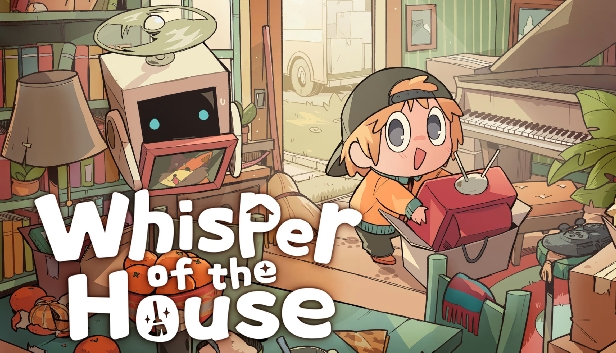

<div align="center">
  <h1>Whisper of the House Project Patcher</h1>

  

  <p>
    A game wrapper that generates a Unity project from Whisper of the Houses's build that can be playable in-editor
  </p>
</div>
<br />

# Table of Contents

- [Recent Updates](#recent-updates)
- [Current State](#current-state)
- [About the Project](#about-the-project)
- [Getting Started](#getting-started)
- [Installation](#installation)
- [Usage](#usage)
- [FAQ](#faq)

## Current State

This project is currently in a early stage of development. It is able to extract the necessary game assets, move the required DLLs, and apply a number of source code patches to generate a Unity project that can be opened normally in the Unity editor without entering Safe Mode.

However, the generated project might **not yet be fully functional**. Many issues that occur while entering Play Mode have been fixed. If you own Febucci Package, you don't really have any main issues, except no audio and minor inconveniences like shaders that need to be adjusted.

However, the available project data is already sufficient to start experimenting with mods and to learn how the game is structured.  

There are known runtime issues, such as a crash caused by Wwise during the initialization of `SetBasePath`. This can currently be avoided by disabling the `AkInitializerCompat` GameObject. Or by not entering the Main Menu scene.

## About the Project

This tool is a game wrapper on top of the [Unity Project Patcher](https://github.com/nomnomab/unity-project-patcher) and was build by looking into other Wrappers like https://github.com/Kesomannen/unity-repo-project-patcher. (As you might notice from the very similar Readme)

The Tool takes a build of Whisper of the House, extracts its assets/scripts/etc, and then generates a project for usage in the Unity editor.

> [!IMPORTANT]  
> This tool does not distribute game files. It simply works off of your copy of the game!
>
> Also, this tool is for **personal** use only. Do not re-distrubute game files to others.

## Getting Started

Make sure you have the following before using the tool in any way:

- [Git](https://git-scm.com/download/win)
  - To download packages in Package Manager through git URL
- [.NET 9.0](https://dotnet.microsoft.com/en-us/download/dotnet/9.0)
  - To run Asset Ripper

> [!IMPORTANT]  
> The Project requires up to ~17GB of free Space.


## Installation

### Unity Project

- Requires [Unity 2021.3.45f2](https://unity.com/de/releases/editor/whats-new/2021.3.45f2)
- Unity (3D) URP render pipeline

Create a new Unity project with the above requirements before getting started.

You will need to install two packages in sequence here:

- Unity Project Patcher: `https://github.com/nomnomab/unity-project-patcher.git`
  - [Can be disabled](#disabling-bepinex-usage)
- This project

### Installing the Unity Project Patcher core

1. Open the Package Manager from `Window > Package Manager`
2. Click the '+' button in the top-left of the window
3. Click 'Add package from git URL'
4. Provide the URL of the this git repository: `https://github.com/nomnomab/unity-project-patcher.git`
   - If you are using a specific version, you can append it to the end of the git URL, such as `#v1.2.3`
5. Click the 'add' button

```json
"com.nomnom.unity-project-patcher": "https://github.com/nomnomab/unity-project-patcher.git"
```

- If you are using a specific version, you can append it to the end of the git URL, such as `#v1.2.3`

### Installing this Game Wrapper

The same steps as previously, just with `https://github.com/Skydorm1/unity-woth-project-patcher.git`

## Usage

The tool window can be opened via `Tools > Unity Project Patcher > Open Window`

1. Open the **Unity Project Patcher** window and press **Run**.
2. If Unity asks you to restart for the **Input System**, select **Yes**.
3. If Unity asks whether to enter **Safe Mode**, select **Ignore** and allow the project to open normally. This will happen 2 times throughout the whole process. Make sure to press ignore, otherwise it will not continue till you do so.

> [!IMPORTANT]  
> Keep your mods in a seperate folder, so if a mendatory update is pushed for the game that breaks mods, you can move important folders with you.
> You probably need to patch the Project from the start if that happens.

Estimated patch durations:

- Fresh patch: ~1:30h

These can vary wildly depending on system speed and project size.

For this project, we use a **custom AssetRipper build** that makes use of the newest version of AssetRipper 2.0, while the one in the REPO wrapper was custom and 1.3 i think.

The project should now be able to enter Play Mode, **as long as you start from the `InGameLevelEditor` scene**.

The main menu currently has an issue related to **Wwise**, so it should be avoided for now, or just disable "AkInitializerCompat" object, than it should load.

There are currently two major known issues:

1. **Text Animator**
2. **Wwise**

These are the remaining major areas that still need investigation and fixing. Tho I'm working on some tools to just **add** custom stuff easily. So that you only have to prepare the files in unity, build the bundle and switch to the game, without ever touching playmode.

### Known Additional Issue

Currently Shaders need adjustment, otherwise i haven't ran into any other issues.

## FAQ

**Q: Why is my game crashing, when going into playmode in main menu**

You have to deactivate the Object "AkInitializerCompat" in the main menu Scene.

**Q: I get errors with Febucci**

There is currently no workaround for that, it's the biggest hurdle atm if you don't own the package.
